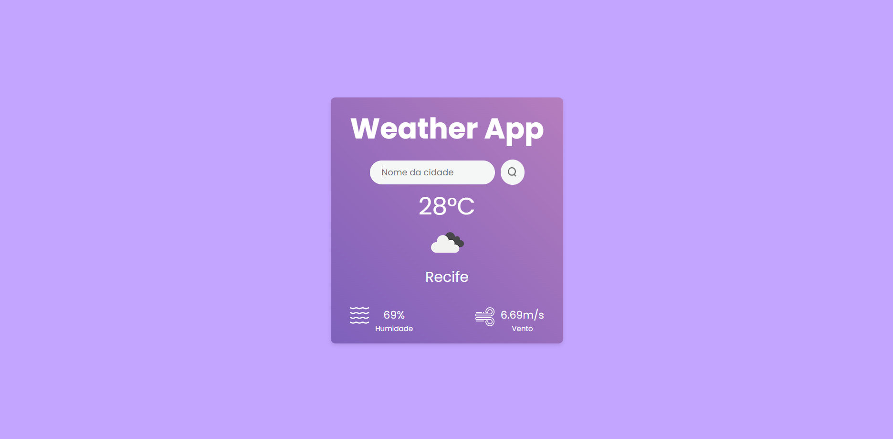

# Weather App



## Descrição

Este é um projeto pessoal de um aplicativo de clima desenvolvido com React e utilizando a API da OpenWeatherMap para obter dados meteorológicos em tempo real.

## Funcionalidades

- Busca de informações meteorológicas por cidade.
- Exibição de temperatura, umidade, velocidade do vento e descrição do clima.
- Exibição de ícones representando o estado do clima atual.
- Mensagens de erro para cidades não encontradas ou outros problemas de conexão.

## Tecnologias Utilizadas

- [React](https://reactjs.org/)
- CSS

### API Externa

- [OpenWeatherMap](https://openweathermap.org/)

## Pré-requisitos

- [Node.js](https://nodejs.org/)

## Instalação e Execução

Siga estas etapas para rodar o projeto na sua máquina local:

1. **Clone o repositório:**

   ```bash
   git clone https://github.com/seu-usuario/weather-app.git
   cd weather-app
